# Architectural Diagrams

This document outlines the key architectural diagrams for the C++ SDK, providing a visual understanding of its structure and components.

## Streamlined SDK Class Structure

This section outlines the revised, streamlined class and struct organization for the C++ SDK, emphasizing generic message handling, specific typed payloads, and a user-friendly method-based client API. This approach aims to improve developer experience and maintainability while strictly adhering to the MCP specification.

### I. SDK Client API (Primary User Interaction)

The primary way developers will interact with the SDK is through methods on client objects. These methods correspond directly to MCP operations, abstracting the underlying request/response lifecycle.

*   **`SDK_Client`**: The main entry point for the SDK.
    *   Provides access to feature-specific client stubs/objects (e.g., `resources()`, `prompts()`).
    *   Handles session management, connection, and overall client state.
*   **Feature-Specific Client Stubs (e.g., `ResourcesClientStub`, `PromptsClientStub`)**:
    *   Group related MCP operations (e.g., `ResourcesClientStub` would have `list()`, `read()`, `subscribe()`).
    *   Each method (e.g., `list(const MCP_ResourcesListParams& params)`) takes relevant parameters (often as a specific `Params` struct) and returns the corresponding `Result` struct (or a future/promise of it, e.g., `std::future<MCP_ResourcesListResult>`).
    *   Internally, these methods use the generic message envelopes and payload definitions (described below) to communicate with the server.

### II. Core Message Envelopes (Internal SDK Mechanism)

These are the primary classes developers will interact with for sending and receiving messages.

1.  **Base Message Type:**
    *   `MCP_MessageBase`: Common base for all MCP messages (contains `jsonrpc`).

2.  **Generic Request Wrapper:**
    *   `MCP_RequestBase`: Abstract base for requests (contains `id`, `method`).
    *   `MCP_Request<ParamsType>`: Template class for specific requests.
        *   Inherits from `MCP_RequestBase`.
        *   Holds a `ParamsType params;` member.
        *   The `method` string is associated with the `ParamsType`.

3.  **Generic Response Wrapper:**
    *   `MCP_ResponseBase`: Abstract base for responses (contains `id`, `error?`).
    *   `MCP_Response<ResultType>`: Template class for specific responses.
        *   Inherits from `MCP_ResponseBase`.
        *   Holds an `std::optional<ResultType> result;`
        *   A specialization `MCP_Response<void>` (or using `MCP_EmptyResult`) handles empty successful results.
    *   `MCP_ErrorObject`: Standard structure for error details within responses.

4.  **Generic Notification Wrapper:**
    *   `MCP_NotificationBase`: Abstract base for notifications (contains `method`).
    *   `MCP_Notification<ParamsType>`: Template class for specific notifications.
        *   Inherits from `MCP_NotificationBase`.
        *   Holds a `ParamsType params;` member.

### III. Payload Definitions (Structs for `ParamsType` and `ResultType`)

These structs represent the specific `params` or `result` objects for each MCP method, ensuring type safety and spec accuracy.

1.  **Utility Payloads:**
    *   `MCP_EmptyParams`: Used as `ParamsType` for requests/notifications without parameters.
    *   `MCP_EmptyResult`: Used as `ResultType` for responses with an empty success object (`{}`).
    *   `MCP_ListResult<ItemType>` (Conceptual): Template struct for common list results (e.g., `std::vector<ItemType> items; std::optional<std::string> nextCursor;`). This would translate to specific instantiations or individual structs per list type if a direct template isn't used for the result itself, but the pattern is key.

2.  **Common Data Structures:**
    *   `MCP_ImplementationInfo`: (e.g., for `clientInfo`, `serverInfo`)
    *   `MCP_ClientCapabilities`: Contains various client capability flags/objects.
        *   `MCP_RootsCapability`
        *   `MCP_SamplingCapability`
    *   `MCP_ServerCapabilities`: Contains various server capability flags/objects.
        *   `MCP_ResourcesCapability`
        *   `MCP_PromptsCapability`
        *   `MCP_ToolsCapability`
        *   `MCP_LoggingCapability`
        *   `MCP_CompletionsCapability`
    *   `MCP_Role`: (Enumeration: `USER`, `ASSISTANT`)
    *   `MCP_LoggingLevel`: (Enumeration)
    *   `MCP_Annotations`: (General purpose annotations)

3.  **Content Types (Payloads for messages or parts of other payloads):**
    *   `MCP_ContentBase`: Abstract base for rich content.
        *   `MCP_TextContent`
        *   `MCP_ImageContent`
        *   `MCP_AudioContent`
        *   `MCP_EmbeddedResourceContent` (references `MCP_TextResourceContents` or `MCP_BlobResourceContents`)

4.  **Specific Method Payloads (Examples - a full list is extensive but follows this pattern):**

    *   **Initialization:**
        *   `MCP_InitializeParams`: (`protocolVersion`, `capabilities`, `clientInfo`)
        *   `MCP_InitializeResult`: (`protocolVersion`, `capabilities`, `serverInfo`, `instructions?`)
        *   `MCP_InitializedParams`: (could be `MCP_EmptyParams`)
    *   **Resources Feature:**
        *   `MCP_Resource`: (Defines a resource item)
        *   `MCP_ResourceTemplate`
        *   `MCP_TextResourceContents`
        *   `MCP_BlobResourceContents`
        *   `MCP_ResourcesListParams`: (`cursor?`) -> Result: `MCP_ListResult<MCP_Resource>`
        *   `MCP_ResourcesReadParams`: (`uri`) -> Result: `MCP_ResourcesReadResult` (contains array of `MCP_TextResourceContents` | `MCP_BlobResourceContents`)
        *   `MCP_ResourcesTemplatesListParams`: (`cursor?`) -> Result: `MCP_ListResult<MCP_ResourceTemplate>`
        *   `MCP_ResourcesSubscribeParams`: (`uri`) -> Result: `MCP_EmptyResult`
        *   `MCP_ResourcesUnsubscribeParams`: (`uri`) -> Result: `MCP_EmptyResult`
        *   `MCP_NotificationsResourcesListChangedParams`: (likely `MCP_EmptyParams`)
        *   `MCP_NotificationsResourcesUpdatedParams`: (`uri`)
    *   **Prompts Feature:**
        *   `MCP_PromptArgument`
        *   `MCP_Prompt`: (Defines a prompt, contains `MCP_PromptArgument`s)
        *   `MCP_PromptMessage`: (`role`, `content` of `MCP_ContentBase` type)
        *   `MCP_PromptsListParams`: (`cursor?`) -> Result: `MCP_ListResult<MCP_Prompt>`
        *   `MCP_PromptsGetParams`: (`name`, `arguments?`)
        *   `MCP_PromptsGetResult`: (`description?`, `messages`: array of `MCP_PromptMessage`)
        *   `MCP_NotificationsPromptsListChangedParams`: (likely `MCP_EmptyParams`)
    *   **Tools Feature:**
        *   `MCP_JSONSchemaObject`
        *   `MCP_ToolAnnotations`
        *   `MCP_Tool`: (Defines a tool, contains `MCP_JSONSchemaObject`, `MCP_ToolAnnotations`)
        *   `MCP_ToolsListParams`: (`cursor?`) -> Result: `MCP_ListResult<MCP_Tool>`
        *   `MCP_ToolsCallParams`: (`name`, `arguments?`)
        *   `MCP_CallToolResult`: (`content`: array of `MCP_ContentBase`, `isError?`)
        *   `MCP_NotificationsToolsListChangedParams`: (likely `MCP_EmptyParams`)
    *   **Client Features (Roots, Sampling - Payloads for Server-to-Client Requests or Client-to-Server Notifications):**
        *   `MCP_Root`
        *   `MCP_RootsListParams_S2C`: (likely `MCP_EmptyParams` from Server) -> Result from Client: `MCP_RootsListResult_S2C` (`roots`: array of `MCP_Root`)
        *   `MCP_NotificationsRootsListChangedParams_C2S`: (likely `MCP_EmptyParams` from Client)
        *   `MCP_SamplingMessage`: (`role`, `content`)
        *   `MCP_ModelHint`
        *   `MCP_ModelPreferences`
        *   `MCP_SamplingCreateMessageParams_S2C`: (from Server, complex: `messages`, `modelPreferences?`, etc.) -> Result from Client: `MCP_SamplingCreateMessageResult_S2C` (`role`, `content`, `model`, `stopReason?`)
    *   **Utilities:**
        *   `MCP_PingParams`: (could be `MCP_EmptyParams`) -> Result: `MCP_EmptyResult`
        *   `MCP_ProgressMeta`: (Part of other request params: `_meta { progressToken }`)
        *   `MCP_NotificationsProgressParams`: (`progressToken`, `progress`, `total?`, `message?`)
        *   `MCP_NotificationsCancelledParams`: (`requestId`, `reason?`)
        *   `MCP_LoggingSetLevelParams`: (`level`) -> Result: `MCP_EmptyResult`
        *   `MCP_NotificationsMessageParams_S2C`: (`level`, `logger?`, `data`)
        *   `MCP_PromptReference`
        *   `MCP_ResourceReference`
        *   `MCP_CompletionArgument`
        *   `MCP_CompletionCompleteParams`: (`ref`, `argument`)
        *   `MCP_CompletionValue`: (`values`, `total?`, `hasMore?`)
        *   `MCP_CompletionCompleteResult`: (`completion`: `MCP_CompletionValue`)

### IV. Conceptual SDK Components and Transport Layer

These remain largely the same as they define higher-level roles and communication mechanisms.

*   **Conceptual Components:**
    *   `MCP_Host`
    *   `MCP_Client`
    *   `MCP_Server`
    *   `MCP_Session`
*   **Transport Layer:**
    *   `IMCP_Transport` (Interface)
        *   `MCP_StdioTransport`
        *   `MCP_HttpTransport`

## Class Diagram (Streamlined with Client API)

```mermaid
classDiagram
    direction TB

    %% ======== SDK Client API Facade ========
    class SDK_Client {
        +ResourcesClientStub resources()
        +PromptsClientStub prompts()
        +ToolsClientStub tools()
        +initialize(MCP_InitializeParams): std::future~MCP_InitializeResult~
        +ping(): std::future~MCP_EmptyResult~
        %% ... other global utility methods ...
    }

    class ResourcesClientStub {
        +list(MCP_ResourcesListParams): std::future~MCP_ListResult~MCP_Resource~~
        +read(MCP_ResourcesReadParams): std::future~MCP_ResourcesReadResult~
        +subscribe(MCP_ResourcesSubscribeParams): std::future~MCP_EmptyResult~
        +unsubscribe(MCP_ResourcesUnsubscribeParams): std::future~MCP_EmptyResult~
        %% +handle_listChanged_notification(handler)
        %% +handle_updated_notification(handler)
    }
    SDK_Client o--> ResourcesClientStub : provides

    class PromptsClientStub {
        +list(MCP_PromptsListParams): std::future~MCP_ListResult~MCP_Prompt~~
        +get(MCP_PromptsGetParams): std::future~MCP_PromptsGetResult~
        %% +handle_listChanged_notification(handler)
    }
    SDK_Client o--> PromptsClientStub : provides

    class ToolsClientStub {
        +list(MCP_ToolsListParams): std::future~MCP_ListResult~MCP_Tool~~
        +call(MCP_ToolsCallParams): std::future~MCP_CallToolResult~
        %% +handle_listChanged_notification(handler)
    }
    SDK_Client o--> ToolsClientStub : provides

    %% Client Stubs use Generic Wrappers and Payloads
    ResourcesClientStub ..> MCP_Request~ParamsType~ : uses internally
    ResourcesClientStub ..> MCP_Response~ResultType~ : uses internally
    ResourcesClientStub ..> MCP_Notification~ParamsType~ : uses for notifications
    ResourcesClientStub ..> MCP_ResourcesListParams : uses
    ResourcesClientStub ..> MCP_ListResult~MCP_Resource~ : uses

    PromptsClientStub ..> MCP_Request~ParamsType~ : uses internally
    PromptsClientStub ..> MCP_Response~ResultType~ : uses internally
    PromptsClientStub ..> MCP_Notification~ParamsType~ : uses for notifications
    PromptsClientStub ..> MCP_PromptsGetParams : uses
    PromptsClientStub ..> MCP_PromptsGetResult : uses

    %% ======== Core Message Envelopes (Internal) ========
    class MCP_MessageBase {
        +jsonrpc: string
    }

    class MCP_RequestBase {
        <<Abstract>>
        +id: string | number
        +method: string
    }
    MCP_MessageBase <|-- MCP_RequestBase

    class MCP_ResponseBase {
        <<Abstract>>
        +id: string | number
        +error?: MCP_ErrorObject
    }
    MCP_MessageBase <|-- MCP_ResponseBase

    class MCP_NotificationBase {
        <<Abstract>>
        +method: string
    }
    MCP_MessageBase <|-- MCP_NotificationBase

    class MCP_ErrorObject {
        +code: number
        +message: string
        +data?: unknown
    }

    class MCP_Request~ParamsType~ {
        +ParamsType params
    }
    MCP_RequestBase <|-- MCP_Request~ParamsType~

    class MCP_Response~ResultType~ {
        +optional~ResultType~ result
    }
    MCP_ResponseBase <|-- MCP_Response~ResultType~

    class MCP_Notification~ParamsType~ {
        +ParamsType params
    }
    MCP_NotificationBase <|-- MCP_Notification~ParamsType~

    %% --- Payload Struct Examples (Used by Generic Wrappers) ---
    class MCP_InitializeParams {
        +protocolVersion: string
        +capabilities: MCP_ClientCapabilities
        +clientInfo: MCP_ImplementationInfo
    }
    MCP_Request~ParamsType~ ..> MCP_InitializeParams : "params (e.g., if ParamsType is MCP_InitializeParams)"

    class MCP_InitializeResult {
        +protocolVersion: string
        +capabilities: MCP_ServerCapabilities
        +serverInfo: MCP_ImplementationInfo
    }
    MCP_Response~ResultType~ ..> MCP_InitializeResult : "result (e.g., if ResultType is MCP_InitializeResult)"

    class MCP_Resource {
        +uri: string
        +name: string
    }
    class MCP_ListResult~MCP_Resource~ {
        +items: MCP_Resource[]
        +nextCursor?: string
    }
    MCP_Response~ResultType~ ..> MCP_ListResult~MCP_Resource~ : "result (e.g., for resources/list)"


    class MCP_ToolsCallParams {
        +name: string
        +arguments?: object
    }
    MCP_Request~ParamsType~ ..> MCP_ToolsCallParams : "params (e.g., if ParamsType is MCP_ToolsCallParams)"

    class MCP_CallToolResult {
        +content: MCP_ContentBase[]
        +isError?: boolean
    }
    MCP_Response~ResultType~ ..> MCP_CallToolResult : "result (e.g., if ResultType is MCP_CallToolResult)"

    class MCP_InitializedParams {
      %% Typically empty or specific simple fields
    }
    MCP_Notification~ParamsType~ ..> MCP_InitializedParams : "params (e.g., if ParamsType is MCP_InitializedParams)"


    %% --- Common Data Structures ---
    class MCP_ImplementationInfo
    class MCP_ClientCapabilities
    class MCP_ServerCapabilities
    MCP_ClientCapabilities o-- "0..1" MCP_RootsCapability : roots
    MCP_ClientCapabilities o-- "0..1" MCP_SamplingCapability : sampling
    MCP_ServerCapabilities o-- "0..1" MCP_ResourcesCapability : resources
    MCP_ServerCapabilities o-- "0..1" MCP_PromptsCapability : prompts
    MCP_ServerCapabilities o-- "0..1" MCP_ToolsCapability : tools
    class MCP_RootsCapability
    class MCP_SamplingCapability
    class MCP_ResourcesCapability
    class MCP_PromptsCapability
    class MCP_ToolsCapability


    %% --- Content Hierarchy ---
    class MCP_ContentBase {
        <<Abstract>>
        +type: string
        +annotations?: MCP_Annotations
    }
    class MCP_TextContent { +text: string }
    MCP_ContentBase <|-- MCP_TextContent
    class MCP_ImageContent { +data: string, +mimeType: string }
    MCP_ContentBase <|-- MCP_ImageContent
    class MCP_AudioContent { +data: string, +mimeType: string }
    MCP_ContentBase <|-- MCP_AudioContent
    class MCP_EmbeddedResourceContent { +resource: object }
    MCP_ContentBase <|-- MCP_EmbeddedResourceContent

    class MCP_Annotations

    %% --- Transport Layer ---
    class IMCP_Transport {
        <<Interface>>
        +SendMessage(message: MCP_MessageBase)
        +ReceiveMessage(): MCP_MessageBase
    }
    class MCP_StdioTransport
    IMCP_Transport <|.. MCP_StdioTransport
    class MCP_HttpTransport
    IMCP_Transport <|.. MCP_HttpTransport

    %% --- Conceptual Classes (remain for architectural overview) ---
    class MCP_Host { <<Conceptual>> }
    class MCP_Client { <<Conceptual>> }
    class MCP_Server { <<Conceptual>> }
    class MCP_Session { <<Conceptual>> }

    MCP_Client ..> IMCP_Transport : uses
    MCP_Server ..> IMCP_Transport : uses
    MCP_Host o-- MCP_Client : manages
    MCP_Client ..> MCP_Server : communicates_with
    MCP_Client o-- MCP_Session : maintains
    MCP_Server o-- MCP_Session : maintains

    note "SDK_Client and Feature Stubs provide a method-based API."
    note "These methods internally use MCP_Request~T~, MCP_Response~T~, and payload structs."
    note "Generic wrappers MCP_Request~T~, MCP_Response~T~, MCP_Notification~T~ use specific Params/Result structs."
    note "Only a few example Params/Result structs are shown for brevity."
    note "The 'MCP_ListResult~ItemType~' class is a conceptual representation of how list results (e.g. vector of items + cursor) would be structured for various ItemTypes."
```

This diagram offers a higher-level, macroscopic view of the SDK's architecture... (The rest of the descriptive text from before can follow here or be adjusted). 